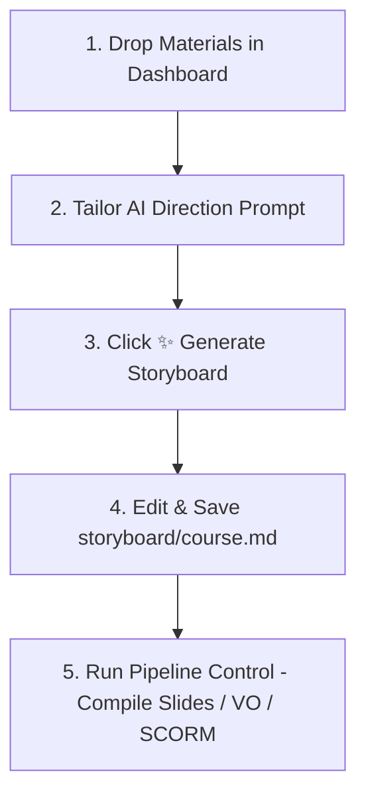

# Porsche WBT Module — Quickstart Checklist
This guide provides the exact step-by-step actions required to set up, initialize, and start authoring a new training module using the **Porsche WBT AI Creator Suite**.

---

## 🛠️ Step-by-Step Initialization

### Step 1 — Copy & Rename Folder
1. Copy the entire `Porsche-WBT-Template/` folder.
2. Paste it in your projects directory and rename it to `Porsche-WBT-CCxx` (where `xx` is your zero-padded module number, e.g., `CC13`).

### Step 2 — Run Per-Module Replacements
The template folder contains default placeholders (`XXXX`). Run the initialization script to stamp your course code and title across all configuration files, SCORM manifests, and players in one pass:
```bash
npm run init-module -- --code CCxx \
  --title "Your Course Title" \
  --player-title "Customer Communications - Module xx - Your Course Title"
```
> [!TIP]
> Keep the title inside the double quotes matching your syllabus. The optional `--player-title` parameter specifies what is shown in the player window header.

### Step 3 — Initialize the Local Repository
Generate a fresh Git repository for this module to keep track of your storyboard edits and slide generations:
```bash
npm run init-repo
```
> [!NOTE]
> This command safely handles running `git init`, staging all initial template files, and making a clean `"Initial commit from template"` commit automatically.

### Step 4 — Install Dependencies
Install the required Node.js development dependencies:
```bash
npm install
```

---

## 🚀 Launching & Authoring

### Step 5 — Run the Dashboard Server
Start your zero-dependency local static server and compilation pipeline:
```bash
node scripts/dashboard-server.js
```

### Step 6 — Access the Dashboard
Open your browser and navigate to the **AI Creator Suite Dashboard**:
👉 **[http://localhost:8085/dashboard.html](http://localhost:8085/dashboard.html)**

> [!IMPORTANT]
> Navigating directly to `http://localhost:8085/` will open the **Slide Player** (`index.html`). You must explicitly type **`/dashboard.html`** in your browser's address bar to access the storyboard authoring and generation tool.

---

## 🎨 Storyboard & Compilation Workflow

Once the dashboard is open, follow this workflow to build your course:



1. **Drop Materials**: Drag your reference PowerPoint outline, WBT info documents, or SME notes directly onto the left-hand panel of the dashboard.
2. **Calibrate Scope**: In the `AI Direction & Module Target Scope` input box, specify instructions (e.g., *"Limit the scope to standard slides 1S01-1S08. Make it highly technical for Porsche technicians."*).
3. **Generate**: Click **✨ Generate Storyboard** to kick off background processing.
4. **Edit & Refine**: Use the middle text panel to review and refine your generated `storyboard/course.md` file. Don't forget to click **Save Storyboard**.
5. **Run the Pipeline**: In the right-hand panel, click the action buttons to compile slides, generate voiceovers, output GSAP cues, or pack a standard SCORM `.zip` package.
